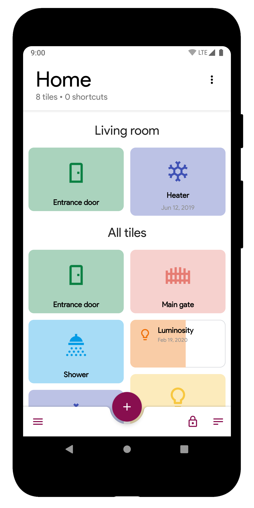
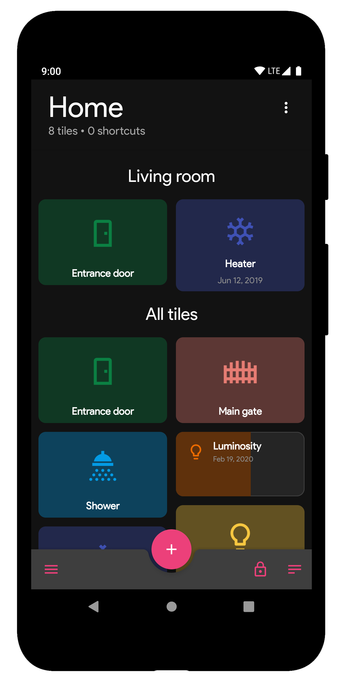

# MQTT Dashboard

MqttDashboard is an Android application designed to allow you to interact, control and manage your MQTT-enabled devices, focusing on ease of use and on a beautiful User Interface.

{: style="height:300px"}
{: style="height:300px"}

The focus of the app is **not** to create a MQTT network, and this goes to say that MqttDashboard is **not** a MQTT broker/server. You are supposed to provide it yourself, either by installing one on a local machine or by exploiting an online service. Discover more at the [dedicated page](brokers.md).

Through commonly-used or dedicated interface components - also called *tiles* here - you should be able to build yourself a great looking and extremely functional MQTT-enabled dashboard. 

In the next pages, we will try to guide you through setting up and running the application, getting comfortable with it and with its characteristics. We hope you'll enjoy the journey!

[{ align=left }](https://play.google.com/store/apps/details?id=com.app.vetru.mqttdashboard) Get yourself MqttDashboard from the Google PlayStore!